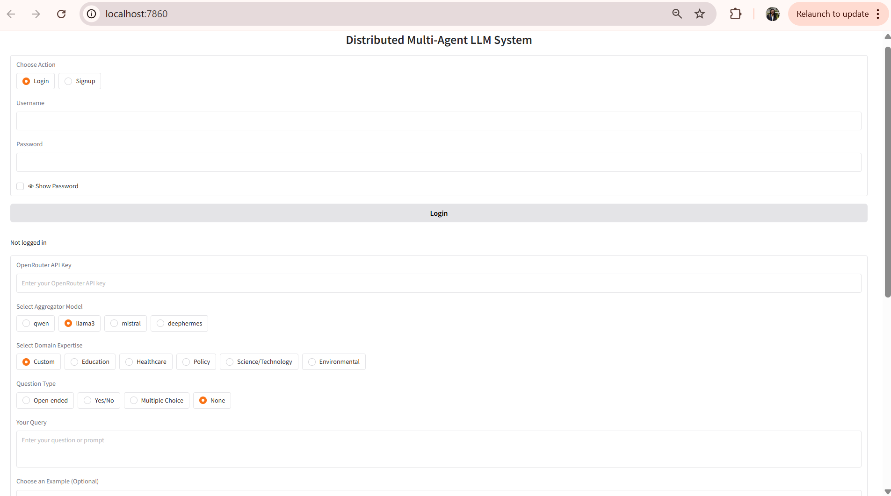

# Engineering Notebook

## Distributed Multi-Agent LLM System

This engineering notebook documents the development process of our Distributed Multi-Agent LLM System project. The system uses multiple different language transformer models to process queries in parallel and synthesizes their responses to ideally produce more robust, nuanced answers by aggregating insights.

## Architecture

The system follows a client-server architecture:

1. **Backend Server** (`server.py`): Manages LLM agents, handles query processing, performs response aggregation and analysis, and provides REST API endpoints.

2. **Client Application** (`client.py`): Offers a Gradio-based user interface for submitting queries, viewing responses, and analyzing results.

3. **Database Manager** (`database_manager.py`): Handles data persistence, user authentication, and interaction history.

## Key Features

- **Multi-Model Querying**: Distributes queries to multiple LLM models
- **Consensus Aggregation**: Synthesizes responses to produce a comprehensive answer
- **Agent Health Monitoring**: Tracks model availability and performance
- **Response Analysis**: Provides visualization and metrics for model agreement
- **User Management**: Authentication and history tracking
- **Domain Expertise**: Adds domain-specific context to queries

## Day to Day Progress

#### March 29, 2025

We initiated development of the multi-agent consensus system for analyzing responses from various LLMs. The primary focus was on setting up the repository structure, defining the project’s scope, and installing any relevant dependencies.

##### Work Completed 

- Repository Setup
    - Created the initial GitHub repository and put source code we were going to use as base for our project (the source code was generated using Claude AI, which we would then update and edit to better fit our project objectives)

- Development Environment
    - Installed key dependencies and libraries.
    - Started to establish the framework for leader-follower interaction with the LLM models and model aggregation.

- At this point in our project, rather than evaluating consensus and bias in LLMs, we were planning on trying to create a similar application but for aggregating responses for solving math problems. The idea was that since lightweight LLM models are bad at solving math problems, if we aggregate and put together multiple model responses, we may be more likely to get to the right answer with a consensus mechanism. What we ended up finding was that the math models were still performing pretty poorly and so we needed to re-evaluate our project approach.

#### April 7, 2025

We pivoted to evaluating more generally consensus amongst language transformer models, since there are more models to choose from and it would be easier to test conceptually. We implemented the starter codebase, defining the modular structure that would host the LLM interaction logic, visualization, and UI components. We also focused on testing lightweight models again that we could access, use for our project, and had decent latency.

##### Work Completed

- Code Structure & Modules
    - Added configuration files and base Python modules.
    - Separated responsibilities between model handling, UI, and response processing.

- Environment Setup
    - Created reproducible environments using requirements.txt and conda setup.
    - Tested basic script execution to ensure compatibility.

#### April 14, 2025

We implemented the foundational architecture for the multi-agent consensus system. Key components like LLM interaction logic, client-server structure, and basic plotting utilities were added.

##### Work Completed

- Base Architecture
    - Implemented core logic for querying multiple LLMs and retrieving responses.
    - Created initial Gradio-based UI for client interaction.

- Visualization Features
    - Added early plotting utilities for visualizing outputs from multiple agents.

- Server Endpoints
    - Built server endpoints to handle incoming user queries and return model responses.

#### April 15, 2025

We focused on enhancing visualization and enabling users to select different aggregator models for consensus generation. Radar plots and emotional analysis charts were added.

##### Work Completed

- Advanced Visualizations
    - Implemented radar charts for feature comparison.
    - Added polarity and emotion analysis charts for response sentiment.

- Aggregator Logic
    - Enabled model selection as the aggregator responsible for consensus.
    - Improved UI readability with clearer formatting.

#### April 16, 2025

We added domain-specific expertise by allowing users to query different domains like Education, Policy, and Healthcare. We also improved visual rendering and query examples.

The following are some of the plots that we generated with out updated analysis code for the following query

  

  

  

  

  

##### Work Completed

- Domain Expert Mode
    - Integrated example queries and visual theming for domains: Education, Healthcare, Policy, Science, and Environmental.

- Formatting & Rendering
    - Enhanced response chart rendering.
    - Fixed image handling issues to display consistent visual feedback.

#### April 18, 2025

Persistence was implemented using SQLite to store user profiles, query history, and model responses. Challenges arose around concurrency and session management.

##### Work Completed

- SQLite Integration
    - Persisted user authentication data and interaction logs.
    - Implemented basic query history retrieval and storage.

- Challenges Tackled
    - Addressed database connection sharing across components.
    - Handled simultaneous query access and session stability.

#### April 19, 2025

LLM fault tolerance was added, with health checks, heartbeat pings, and automatic agent fallback mechanisms. This ensures robust behavior during agent downtimes.

##### Work Completed

- Heartbeat Monitoring
    - Health checks every 30 seconds for each agent.
    - Agent states categorized as healthy, unhealthy, or failed.

- Recovery System
    - Automatic reassignment of aggregator models if a primary model fails.
    - Retry mechanisms with exponential backoff.

#### April 21, 2025

We added secure user authentication and finalized documentation. Passwords are hashed securely, and sessions are managed to preserve query history.

This is what our Gradio interface looks like after incorporating the new account-related features:

  

  

##### Work Completed

- Authentication System
    - Implemented login/signup with SHA-256 password hashing.
    - Managed secure session tokens and logout functionality.

- Comprehensive Documentation
    - Added Google-style docstrings for all major functions.
    - Updated README.md with installation steps and usage instructions.

- Authentication Flow
    - Designed login/signup interface with history association.
    - Ensured secure logout and session reset procedures.