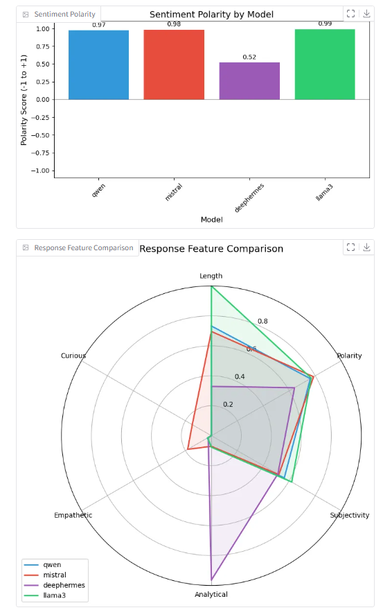

# Engineering Notebook: Distributed Multi-Agent LLM System

This engineering notebook documents the design, development, and progress of our Distributed Multi-Agent LLM System. The project explores how multiple lightweight language models can be orchestrated in parallel to improve response reliability, ethical coverage, and system resilience.

The full source code is available [here](https://github.com/ManasviGoyal/Distributed-Multi-Agents).
More details on the code structure and how to run the code can be found in the [`README.md`](https://github.com/ManasviGoyal/Distributed-Multi-Agents/blob/main/README.md). Also, the deployed documentation can be found [here](https://manasvigoyal.github.io/Distributed-Multi-Agents/). The post presented at the SEAS design fail can be found [here](https://github.com/ManasviGoyal/Distributed-Multi-Agents/blob/main/poster.pdf).

The following notebook sections document the motivation, technical architecture, implementation choices, and development timeline for this project.

## Table of Contents

1. [Need and Motivation](#need-and-motivation)
2. [Architecture](#architecture)
3. [Multi-Agent Collaboration and Aggregation Mechanism](#multi-agent-collaboration-and-aggregation-mechanism)
4. [How a Query Flows Through the System](#how-a-query-flows-through-the-system)
5. [Analysis and Results of Model Responses](#analysis-and-results-of-model-responses)
6. [Design Decisions](#design-decisions)
7. [Day to Day Progress](#day-to-day-progress)

## Need and Motivation

Large Language Models (LLMs) have demonstrated impressive capabilities across a wide range of reasoning and generation tasks, but relying on a single LLM often leads to unpredictable, inconsistent, or biased responses and they typically lack fault tolerance. If the model fails, the entire system fails. Additionally, frequent external API usage incurs high costs and latency, especially when re-querying similar prompts. Moreover, individual models tend to represent narrow ethical perspectives, limiting the diversity of viewpoints in sensitive or morally complex domains.

To address these challenges, we designed and built a distributed multi-agent system in which multiple LLMs reason independently on the same prompt, and an aggregator model synthesizes a consensus response. This setup improves reliability by introducing redundancy, ensures fault tolerance through dynamic failover mechanisms, and enhances ethical diversity by allowing each model to adopt different normative perspectives. The system also significantly reduces API costs and latency through local caching and persistence.

The motivation behind implementing this multi-agent system with a distributed architecture was to enable parallelism, modular scalability, and resilience. Separating the client, load balancer, backend servers, and model agents into independent components allowed us to isolate failures, deploy updates without downtime, and dynamically balance load across agents. This way we can split incoming workload across many agents to process requests in parallel and add or remove agents on the fly without interrupting service. If one component needs maintenance or encounters an error, the others keep running, so the overall system stays responsive. At the same time, our central database collects every request and response in one place, making it easy to review past decisions, spot bottlenecks, and debug issues. Over time, this approach would give us a system that remains fast under heavy load, can evolve through incremental updates, and whose internal reasoning trails are always available for inspection.

## Architecture

The system architecture consists of multiple independently deployed agents for independent reasoning, a central aggregator to synthesize and summarize those individual responses into a coherent consensus, a load-balancer that implements sticky routing for job-specific endpoints (status/result/image) and a round-robin strategy with retry logic for 2-fault tolerance, and a persistent SQLite database to record every interaction, agent response, consensus analysis and user authentication. These components communicate through well-defined APIs and are coordinated to deliver high-availability, low-latency query handling. The following sections provide a deeper look into the internal structure and behavior of these components.

### Database Schema and Persistence

The structure of the system’s database is depicted in **Figure 1**, which shows the relationships between users, queries, model responses, and analysis results. The `USERS` table stores authentication credentials, with each user identified by a unique ID, a username, and a hashed password. Each user interaction with the system is recorded in the `INTERACTIONS` table, which links back to the `USERS` table via a foreign key on the username. Every interaction is assigned a unique `job_id` and captures the query text, domain, question type, and a timestamp. Associated with each interaction are multiple entries in the `RESPONSES` table, where each response corresponds to a specific model (identified by `agent_id`), includes the model's output, a flag indicating whether it was generated by the aggregator, and a timestamp. Additionally, for every interaction, a detailed analysis is stored in the `ANALYSIS` table, linked via the `job_id`. This table records metrics such as the consensus score and serialized analysis data, including sentiment scores and similarity matrices.

  

<em>Figure 1. Database schema. Tables store users, interactions, agent responses, and aggregated analysis, enabling persistent storage, fast retrieval, and reduced reliance on external APIs.</em>

Persistence plays a crucial role in ensuring that all user queries, model-generated responses, and consensus summaries are reliably stored within the system. By maintaining a complete historical record, the platform allows users to revisit past queries, reload previous results instantly, and continue sessions seamlessly without re-querying external APIs. This approach not only enhances user experience by providing fast and reliable access to historical data but also improves system robustness. Furthermore, by caching both raw model outputs and aggregated analyses locally, the system significantly reduces redundant API calls, lowering computational costs, minimizing external API usage, and reducing latency.

### System Component Overview

The overall system design is illustrated in Figure 2, showing the interaction between major components. Users interact with the system through the client application, which is built using Gradio and provides interfaces for query submission, user authentication, history management, and visualizations. The client communicates with a Load Balancer that intelligently distributes incoming requests to one of several available ackend Servers. These backend servers are responsible for processing queries by interacting with various LLM models such as Qwen, Llama3, Mistral, and DeepHermes. Each server can independently communicate with the models, execute query processing tasks, perform response aggregation, and generate analytical insights. Once responses and analysis are produced, the backend servers update the central SQLite database, ensuring that all user interactions, model outputs, and generated visualizations are persistently stored. This modular design, with clearly separated responsibilities across clients, servers, and models, enables the system to scale efficiently, maintain robustness, and allow seamless expansion or replacement of individual components without disrupting the overall workflow.

  

<em>Figure 2. System architecture overview. The client interacts with backend servers via a load balancer. Backend servers process queries, coordinate with LLM agents, and persist results in a centralized database.</em>

### Fault Tolerance and Agent Failover Mechanism

Figure 3 which illustrates the fault tolerance and agent failover mechanism. Each agent model periodically (every 10 seconds) sends heartbeat signals to a centralized Heartbeat Tracker. This component monitors agent health in real-time by updating a shared Health Status Store based on heartbeat timeouts and API error logs. If an agent fails to send a heartbeat or exhibits repeated API errors, it is marked as unhealthy or failed. The system then attempts recovery using exponential backoff, and if necessary, triggers an **Agent Reset** procedure. This reset mechanism allows the system to retain degraded agents and reintroduce them when they recover.

  

<em>Figure 3. Fault tolerance and failover mechanism. Agents send periodic heartbeats; failures trigger recovery or replacement. Aggregator failure activates a backup to ensure uninterrupted consensus.</em>

In cases where the failed agent is an aggregator responsible for synthesizing responses across models, the system enters an **Aggregator Failover** state. It detects failure through invalid response validation and immediately selects a healthy backup model to assume the aggregator role. This ensures that the core functionality of consensus generation is not disrupted. For standard agents (e.g., Qwen, Mistral, DeepHermes), the system uses the same health signals to determine when to replace a model or assign a new one dynamically. The failover design guarantees that even if multiple agents crash or become unresponsive, the system continues to process user queries without interruption. By maintaining health checks and allowing automated role reassignment, this mechanism provides robust fault tolerance with minimal human intervention. 

## Multi-Agent Collaboration and Aggregation Mechanism

Our system relies on multiple agent models to independently reason over user queries, and a separate aggregator model to synthesize their responses into a unified, interpretable answer. This design improves robustness, encourages diversity in reasoning, and supports transparent decision-making.

  

<em>Figure 4: Aggregator synthesizes responses from multiple independent agent models.</em>

### Agent Models

**Role:** Each agent receives the same prompt (constructed from the user’s query, domain, and question type) and generates an independent response.

**Selection:** For each request, up to three available and healthy agents are selected. Selection avoids agents recently marked unhealthy due to failed requests or missed heartbeats.

**Execution:** Requests to agents are dispatched in parallel with a timeout and retry mechanism. Any failed or unresponsive agent is skipped and marked as unhealthy.

**Diversity:** Because different models may be used as agents the system benefits from varied reasoning paths and perspectives, which helps surface inconsistencies or bias.

### Aggregator Model

**Role:** The aggregator receives the full set of agent responses and produces a consensus summary. Its job is to reason about the reasoning and identifying common ground, highlighting contradictions, and making a balanced judgment.

**Functionality:**
- Synthesizes a consensus answer from the agents’ outputs.
- Computes a consensus score reflecting alignment or disagreement among agents.
- Performs textual analysis (e.g., sentiment, emotional tone, polarity) to characterize the overall response landscape.
- When a clear consensus cannot be established, the aggregator contributes its own reasoning as a tie-breaker to generate a more decisive output.

**Fallback:** If the user-selected aggregator model is unhealthy, the system automatically switches to a backup aggregator.

This layered design shown in Figure 4 allows us to treat agent models as decentralized, loosely coupled reasoners, and the aggregator as a central judge that weighs, explains, and refines the collective output.

## How a Query Flows Through the System

#### 1. User logs in and submits a query using the Gradio client

#### a. Authentication and Session Start  
The user begins by accessing the system via the Gradio web client. They are prompted to either **log in** using an existing username and password or **sign up** for a new account. Credentials are validated against the backend database, with passwords securely hashed using SHA-256. Upon successful login, a session is initiated and the user is redirected to the query interface.

  

#### b. Query Configuration and Submission
Once authenticated, the user is presented with a configuration panel. Here, they can:
- Enter an **API key** (if using external models via OpenRouter).
- Select a **domain** (e.g., Education, Healthcare, Policy, Environment).
- Choose a **question type** (e.g., Open-ended, Factual, Ethical).
- Assign up to three **ethical roles** to models (e.g., Utilitarian, Libertarian, Virtue Ethics).
- Select an **aggregator model** from a list of available LLMs.

  

After entering the query and configuring all relevant options, the user clicks the **"Submit"** button. 

#### 2. Client sends the request to the Load Balancer  
The Gradio client sends the request as a POST to the load balancer, which routes it to an appropriate backend server based on round-robin or sticky job routing.

#### 3. Load Balancer forwards the request to an available backend server  
The load balancer attempts up to three retries in case of backend failure. If all retries fail, the client is notified of a server error.

#### 4. Backend Server
Once the load balancer forwards the query, the backend server orchestrates the full reasoning pipeline:

- **Query Distribution**: Sends the user’s prompt to multiple agent models (e.g., Qwen, Mistral, DeepHermes), each reasoning independently in parallel.
- **Asynchronous Collection**: Gathers responses from the agents asynchronously, with timeout and retry logic to handle delays or failures.
- **Consensus Generation**: Passes all agent outputs to the selected aggregator model (default: Llama3), which synthesizes a coherent consensus response.
- **Post-Aggregation Analysis**: Computes similarity scores, sentiment, emotion, and feature comparisons between responses.
- **Persistence**: Saves all raw responses, the consensus summary, and visual analysis results to the SQLite database for later retrieval.

#### 5. Client fetches and displays the processed results in the Gradio GUI

Once the backend completes processing, the client retrieves and presents all results within the interactive Gradio interface. These results are grouped into two categories:

**a. Aggregated Output**
- **Consensus Summary**: A unified answer synthesized by the aggregator model, reflecting the most aligned or balanced interpretation across agent responses.
- **Individual Agent Responses**: Each participating agent’s raw response is displayed side by side for comparison and transparency.

  

**b. Visual Analysis**
- **Similarity Heatmap**: Highlights semantic overlap between agent responses using embedding-based similarity scores.
- **Sentiment Polarity Chart**: Bar chart showing whether each response is positive, negative, or neutral in tone.
- **Emotional Tone Chart**: Visualization (e.g., stacked bars or pie) representing emotions detected in each response.
- **Radar Plot**: Displays comparative features (e.g., objectivity, assertiveness) across agents and the consensus response.

  
  

All elements are presented interactively in the Gradio GUI, enabling users to scroll, expand, and visually explore both the content and underlying characteristics of the model outputs.

#### 6. User can:
- **View** a timeline of previous interactions, with summaries and timestamps.
- **Reload** any past query and immediately access the saved responses and visualizations without reprocessing.
- **Delete** specific queries from their history, which removes the associated results from both the interface and the persistent database.

  

## Analysis and Results of Model Responses

The system successfully coordinated multiple LLM agents to respond independently to a variety of prompts across domains such as education, healthcare, policy, and ethics. Below are key observations based on the outputs and analysis visualizations.

### 1. Diversity in Reasoning

Different models often provided varied interpretations, especially for open-ended or multiple choice questions. This demonstrated the value of multi-agent querying: even when answers overlapped in content, the tone, structure, and emphasis often diverged. Some models showed cautious phrasing while others took more assertive stances.

### 2. Consensus Aggregation

The aggregator consistently generated coherent summaries that balanced the most relevant or commonly agreed-upon points. In cases of strong agreement among agents, the consensus output closely resembled the individual responses. When agents diverged significantly, the aggregator flagged the disagreement through lower consensus scores and qualified language (e.g., "While some models suggest..."). In cases where no clear consensus emerged, the aggregator contributed its own reasoning as a tie-breaker, ensuring that a definitive and thoughtful response was still produced.

### 3. Impact of Domain Context, Question Type and Ethical Roles

- **Domain Prefixes** provided contextual framing that nudged models to respond from the perspective of a subject-matter expert. For instance, selecting the *Healthcare* domain added a prefix such as *"As a health policy expert,"* which resulted in more focused, jargon-aware, and practically grounded outputs.

- **Question Types** shaped how models interpreted the prompt:
  - *Open-ended*: Encouraged broad, reflective reasoning using ethical or strategic framing.
  - *Yes/No*: Prompted binary answers followed by moral, emotional, and practical justification.
  - *Multiple Choice*: Presented a scenario with three options (A, B, or C), requiring the model to select one and analyze the pros and cons of each.

- **Ethical Role** assignment was applied so that agent responses clearly reflected their respective philosophical viewpoints. This allowed for diverse perspectives on the same prompt and highlighted the interpretive flexibility of LLMs.

These configurations helped reduce hallucinations, improved response relevance, and gave users finer control over how prompts were interpreted and answered. This also allowed for more targeted comparisons when analyzing model agreement and divergence.

## Design Decisions

As we built the system, we made several important design choices to keep it reliable, easy to scale, and simple to use. We focused on keeping the parts of the system separate, making it efficient, and ensuring it could handle problems without breaking The key decisions and the reasoning behind them are outlined below:

### 1. Layered Modular Architecture

We chose to separate the system into distinct layers - Client Application, Load Balancer, Backend Servers, LLM Models, and Database, to make the system modular and maintainable. This allowed us to independently scale or upgrade each component without affecting the others, enabling future flexibility and smoother system evolution.

### 2. Gradio-Based Client Application

For the client interface, we intentionally built the application using Gradio because it offered a lightweight, web-based solution that was quick to develop yet highly interactive. Gradio allowed us to implement login functionality, query submission, history management, and visualization features seamlessly in a single consistent interface.

### 3. Load Balancer with Fault Tolerance

To balance requests efficiently across backend servers, we designed a custom load balancer with both round-robin distribution and sticky routing based on job IDs. We also built in 2-fault tolerance so that if a server failed, the load balancer would automatically retry on alternate servers without interrupting the user experience.

### 4. Distributed Backend Servers

We architected the backend to consist of multiple independent FastAPI servers. Each server was designed to handle model interactions, response aggregation, and analysis generation. This distributed approach ensured that the system could scale horizontally as user load increased, and that failures in one server would not affect others.

### 5. Multi-Agent Query Processing

Rather than relying on a single model, we intentionally designed the system to collect responses from multiple LLM agents. By involving models like Llama, Qwen, Mistral, and DeepHermes for every query, we ensured diversity in reasoning. We believed this would lead to richer consensus building and greater overall robustness in the final outputs.

### 6. Dynamic Aggregator Failover

Understanding that the aggregator model is critical for consensus generation, we implemented a dynamic failover system. If the aggregator became unhealthy, we automatically selected a backup model. This decision was crucial to ensuring that system reliability did not hinge on a single point of failure.

### 7. Heartbeat-Based Health Monitoring

We introduced a heartbeat tracker where each agent sends a signal every 10 seconds. By monitoring heartbeats and API errors, we could detect unhealthy agents early and either reset them or select backups. This  allowed the system to maintain operational integrity without requiring manual supervision.

### 8. Persistence and Caching Strategy

From early on, we prioritized persistence. We designed the system to cache queries, model responses, and analysis results locally in an SQLite database. This allowed users to revisit prior queries without needing to re-call external APIs, which greatly reduced latency, saved API costs, and enhanced user experience.

### 9. Visualization of Analysis Results

We decided to generate visualizations, including heatmaps, sentiment polarity charts, emotional tone distributions, and radar plots. These were integrated into the client to allow users not only to read responses but also to interpret underlying model behavior visually.

### 10. Emphasis on Fault Tolerance and Resilience

We added retry mechanisms in the load balancer, heartbeat-based health monitoring, aggregator failover logic, and database caching. Each of these elements ensured that even under partial system failures, users would experience uninterrupted service.

### 11. API-Driven Stateless Communication

We structured communication between the client, load balancer, and backend servers using clean REST APIs. By keeping each transaction stateless, we made the system easier to scale horizontally and deploy across distributed infrastructures in the future if needed.

## Day to Day Progress

### March 29, 2025

We initiated development of the multi-agent consensus system for analyzing responses from various LLMs. The primary focus was on setting up the repository structure, defining the project’s scope, and installing any relevant dependencies.

#### Work Completed 

- Repository Setup
    - Created the initial GitHub repository and put source code we were going to use as base for our project (the source code was generated using Claude AI, which we would then update and edit to better fit our project objectives)

- Development Environment
    - Installed key dependencies and libraries.
    - Started to establish the framework for leader-follower interaction with the LLM models and model aggregation.

- At this point in our project, rather than evaluating consensus and bias in LLMs, we were planning on trying to create a similar application but for aggregating responses for solving math problems. The idea was that since lightweight LLM models are bad at solving math problems, if we aggregate and put together multiple model responses, we may be more likely to get to the right answer with a consensus mechanism. What we ended up finding was that the math models were still performing pretty poorly and so we needed to re-evaluate our project approach.

### April 7, 2025

We pivoted to evaluating more generally consensus amongst language transformer models, since there are more models to choose from and it would be easier to test conceptually. We implemented the starter codebase, defining the modular structure that would host the LLM interaction logic, visualization, and UI components. We also focused on testing lightweight models again that we could access, use for our project, and had decent latency.

#### Work Completed

- Code Structure & Modules
    - Added configuration files and base Python modules.
    - Separated responsibilities between model handling, UI, and response processing.

- Environment Setup
    - Created reproducible environments using requirements.txt and conda setup.
    - Tested basic script execution to ensure compatibility.

### April 14, 2025

We implemented the foundational architecture for the multi-agent consensus system. Key components like LLM interaction logic, client-server structure, and basic plotting utilities were added.

#### Work Completed

- Base Architecture
    - Implemented core logic for querying multiple LLMs and retrieving responses.
    - Created initial Gradio-based UI for client interaction.

- Visualization Features
    - Added early plotting utilities for visualizing outputs from multiple agents.

- Server Endpoints
    - Built server endpoints to handle incoming user queries and return model responses.

### April 15, 2025

We focused on enhancing visualization and enabling users to select different aggregator models for consensus generation. Radar plots and emotional analysis charts were added.

#### Work Completed

- Advanced Visualizations
    - Implemented radar charts for feature comparison.
    - Added polarity and emotion analysis charts for response sentiment.

- Aggregator Logic
    - Enabled model selection as the aggregator responsible for consensus.
    - Improved UI readability with clearer formatting.

### April 16, 2025

We added domain-specific expertise by allowing users to query different domains like Education, Policy, and Healthcare. We also improved visual rendering and query examples.

#### Work Completed

- Domain Expert Mode
    - Integrated example queries and visual theming for domains: Education, Healthcare, Policy, Science, and Environmental.

- Formatting & Rendering
    - Enhanced response chart rendering.
    - Fixed image handling issues to display consistent visual feedback.

### April 18, 2025

Persistence was implemented using SQLite to store user profiles, query history, and model responses. Challenges arose around concurrency and session management.

#### Work Completed

- SQLite Integration
    - Persisted user authentication data and interaction logs.
    - Implemented basic query history retrieval and storage.

- Challenges Tackled
    - Addressed database connection sharing across components.
    - Handled simultaneous query access and session stability.

### April 19, 2025

LLM fault tolerance was added, with health checks, heartbeat pings, and automatic agent fallback mechanisms. This ensures robust behavior during agent downtimes.

#### Work Completed

- Heartbeat Monitoring
    - Health checks every 30 seconds for each agent.
    - Agent states categorized as healthy, unhealthy, or failed.

- Recovery System
    - Automatic reassignment of aggregator models if a primary model fails.
    - Retry mechanisms with exponential backoff.

### April 21, 2025

We added secure user authentication and finalized documentation. Passwords are hashed securely, and sessions are managed to preserve query history.

#### Work Completed

- Authentication System
    - Implemented login/signup with SHA-256 password hashing.
    - Managed secure session tokens and logout functionality.

- Comprehensive Documentation
    - Added Google-style docstrings for all major functions.
    - Updated README.md with installation steps and usage instructions.

- Authentication Flow
    - Designed login/signup interface with history association.
    - Ensured secure logout and session reset procedures.

### April 23, 2025

We implemented the smart load balancer to manage routing between multiple backend servers, with support for round-robin dispatching and sticky routing for job-related endpoints.

#### Work Completed

- Load Balancer
  - Added FastAPI-based proxy server for request routing.
  - Implemented round-robin strategy and job-specific sticky routing.
  - Built in retry logic with 2-fault tolerance.
  - Tested server fallback and timeout handling.

### April 26, 2025

We created architectural diagrams using Mermaid.js and worked on designing the project poster for submission.

#### Work Completed

- Visualization
  - Created system architecture and component diagrams using Mermaid.js for clear illustration.
  - Integrated diagrams into the engineering notebook and documentation.

- Poster Design
  - Drafted and finalized the layout and content for the project poster.
  - Designed the poster using LaTeX and Inkscape for better fonts and high resolution using `.svg` format,
  - Summarized system goals, architecture, visualizations, and key findings.

### April 27, 2025

Fixed critical issues in the user account creation workflow, improving the authentication pipeline.

#### Work Completed

- Bug Fixes
  - Resolved a bug preventing account creation on first-time login.
  - Improved backend error handling for malformed user data.

### April 29, 2025

We focused on documentation improvements, server refinements, and development environment fixes across platforms (Windows).

#### Work Completed

- Documentation
  - Added missing docstrings across server and database scripts.
  - Expanded the engineering notebook with architectural details and diagrams.
  - Generated Sphinx documentation in read-the-docs theme.

  

- CI/CD & Mocking
  - Created GitHub Actions workflow for building documentation.
  - Added mock imports to support doc building without installing full model dependencies.

- Minor Fixes
  - Updated README and `.gitignore` for cleaner setup.
  - Fixed small bugs in model interaction logic.

### May 2, 2025

We finalized the engineering notebook by cleaning up section formatting, clarifying architecture descriptions, and completing the design decisions section. We also began implementing unit tests.

#### Work Completed

- Notebook Finalization
  - Polished formatting and clarified explanations across all major sections.
  - Added detailed design decisions reflecting system-level trade-offs.

- Testing Infrastructure
  - Set up test suite and began writing unit tests for backend and database modules.
  - Verified test compatibility across environments.

### May 3, 2025

We completed the first round of unit tests and achieved full baseline coverage across key modules.

#### Work Completed

- Testing Completion
  - Finalized test scripts for backend, database manager, and load balancer.
  - Achieved **84%** test coverage.
  - Validated all tests using `pytest` and ensured CI compatibility.
